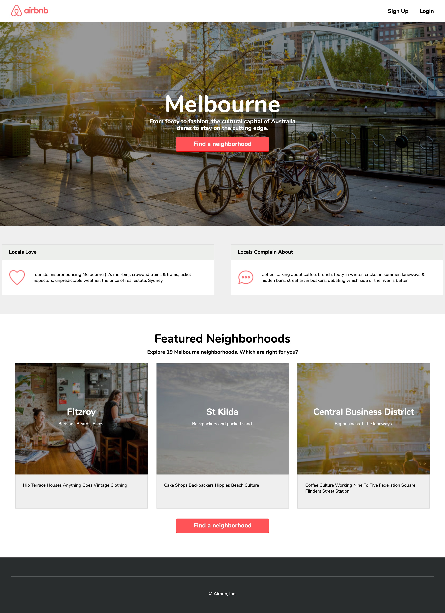

# GA-W3- Airbnb Lab Project

The assignment was to build the page as pictured in the mockup jpg. for airbnb.

## Timeframe

4 hours on week 3 of part-time course at GA.

## Goals
* Identify where use of flexbox is needed.
* Create flex containers.
* Justify and align the elements inside.
* Style reusable components eg. buttons, location items with background images.

## Technologies
* HTML
* CSS
 1. Flexbox
 2. Gradients

## Approach 
I approached this assignment by first writing a Wireframe complemented by a tree diagram sketch, this allowed me to break the layout into horizontal rows and vertical columns and identify where classes will be needed for styling. 

Next moved on to the HTML, use of semantic tags to mark up the page and adding classes to label each element that I will need to style.

Third move was CSS, I started setting uo the broader, general styles eg. colors, fonts. Next moved on to bigger layout and use of flexbox. Latly I styled reusable components eg. buttons, location items with background images.

## To do
* Responsive design 
